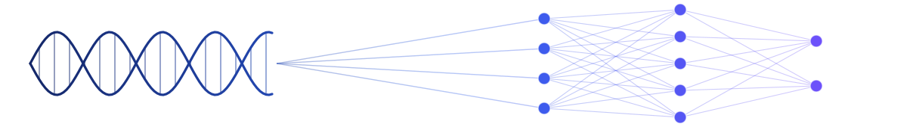

<!-- ═══════════════════════════════  BANNER  ═══════════════════════════════ -->

<div align="center">

<br/><br/>
<a href="https://linkedin.com/in/hasini-de-silva"></a>
<a href="mailto:hasini.s.de.silva@gmail.com"></a>
<a href="https://github.com/hasini-s-de-silva"></a>
<br/><br/>

<br/>
</div>

<!-- ═══════════════════════════════  ABOUT ME  ═══════════════════════════════ -->

## 🧬 About Me

<table>
<tr>
<td width="58%" valign="top">

I work at the intersection of **biology** and **computation**.

On one side sits the science: genomics, protein engineering, drug discovery, and
molecular biology. On the other sits the technical craft: machine learning, data
engineering, scientific software, and high performance computing. My work lives
in the space between them, translating hard biological questions into scalable,
reproducible computational systems, and moving between the two comfortably.

- 🔬 I design **AI and ML models** for therapeutic discovery and biological data analysis
- 🧪 I build **pipelines** for protein modelling, structural bioinformatics, and cancer genomics
- ⚙️ I ship **reproducible scientific software** and data engineering workflows
- 🏥 I develop **healthcare data validation** and anomaly detection systems
- 🚀 Currently exploring **compute-aware** approaches to biological screening

</td>
<td width="42%" valign="top">

```yaml
── Profile ──────────────
Name:      Hasini De Silva
Role:      AI-Driven Bioinformatician
Location:  United Kingdom

── Education ────────────
Degrees:
  - MSc Bioinformatics · Distinction
  - BSc Biomedical Science · First-Class
  - University of Bristol

── Focus ────────────────
Focus:
  - AI for Drug Discovery
  - Protein Design & Structure
  - Cancer & Multi-Omics Genomics
  - Scientific Software & HPC

Open_to:   Collaboration · Research · Roles
```

</td>
</tr>
</table>

<!-- ═══════════════════════════════  SKILLS  ═══════════════════════════════ -->

## ⚡ Engineering AI for Biology

<div align="center">
<i>Understanding the science deeply enough to build software researchers actually trust.</i>
</div>

<br/>

<table>
<tr>
<th width="50%">🧬 &nbsp; Domain Expertise</th>
<th width="50%">💻 &nbsp; Engineering</th>
</tr>
<tr>
<td valign="top">

**🧬 Molecular Biology**


**🧪 Drug Discovery**


**🔬 Structural Biology**


**🧬 Computational Biology**


**🧪 Experimental Biology**


</td>
<td valign="top">

**Programming**


**Scientific Computing**


**Machine Learning**


**Bioinformatics Engineering**


**Software Engineering**


**Data Systems**


</td>
</tr>
</table>

<!-- ═══════════════════════════════  PROJECTS  ═══════════════════════════════ -->

## 🚀 Featured Projects

<table>
<tr>
<td width="50%" valign="top">

### 🧬 Genomics-Cancer-Pipeline
End-to-end TCGA LUAD multi-omics pipeline integrating RNA-seq differential
expression, mutation analysis, and machine learning for tumour classification.

`R` · `Multi-Omics` · `RNA-seq` · `Machine Learning`

</td>
<td width="50%" valign="top">

### ⚛️ Compute-Aware-Protein-Screening
A prototype exploring compute-aware protein candidate prioritisation, showing
how resource constraints can reshape biological screening decisions.

`Python` · `Protein Screening` · `Optimisation`

</td>
</tr>
<tr>
<td width="50%" valign="top">

### 🔗 Haem-Protein-Modelling
AI-driven pipeline for haem protein modelling, integrating deep-learning
structure prediction (Chai-1), HPC workflows, and redox analysis (BioDC) to
study electron transfer systems.

`Python` · `Structure Prediction` · `HPC`

</td>
<td width="50%" valign="top">

### 🧪 Redox-Potential-Analysis
Computational pipeline for large-scale redox potential analysis in protein
systems, extending BioDC with automated batch processing and structural feature
integration for protein engineering.

`Python` · `BioDC` · `Batch Processing`

</td>
</tr>
<tr>
<td width="50%" valign="top">

### 🧫 Training-ML-Models-On-Membrane-Proteins
Using membrane protein libraries to train predictive models of membrane protein
expression in *E. coli*.

`Jupyter` · `Predictive Modelling` · `Proteomics`

</td>
<td width="50%" valign="top">

### 🏥 Healthcare-Migration-Anomaly-Detection
Machine learning prototype for detecting risky healthcare migration batches
using synthetic patient records.

`Python` · `Anomaly Detection` · `Healthcare`

</td>
</tr>
</table>

<!-- ═══════════════════════════════  CLOSER  ═══════════════════════════════ -->

## 🤝 Let's Build the Future of Biology Together

<div align="center">

Building software for researchers, engineers, and founders working at the<br/>
intersection of AI and biology.

Always interested in conversations about computational biology, drug discovery,<br/>
protein engineering, scientific software, and open-source research tools.

<br/>

<a href="mailto:hasini.s.de.silva@gmail.com">
  
</a>
<a href="https://linkedin.com/in/hasini-de-silva">
  
</a>
<a href="./resume.pdf">
  
</a>

<br/>



</div>

<br/>

<div align="center">
<table>
<tr>
<td align="center" width="620">

### 🧬 Engineering AI for Biology

<i>Building open-source tools that make biological research faster, more reproducible, and more accessible.</i>

</td>
</tr>
</table>
</div>
